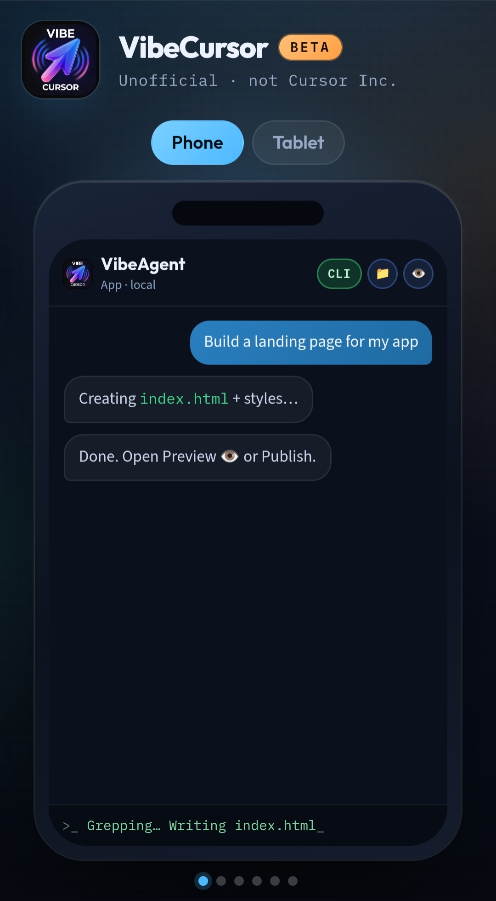
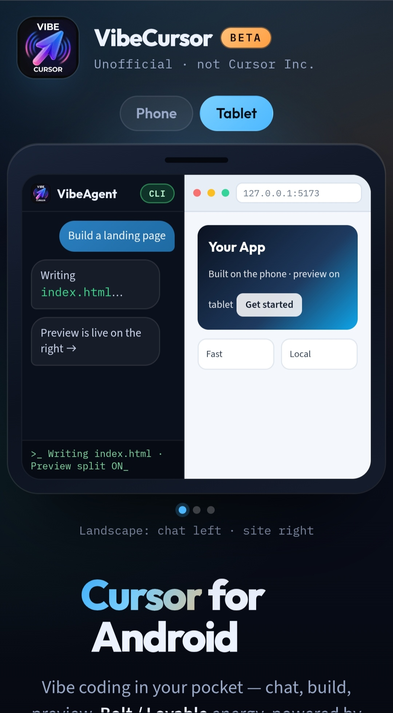
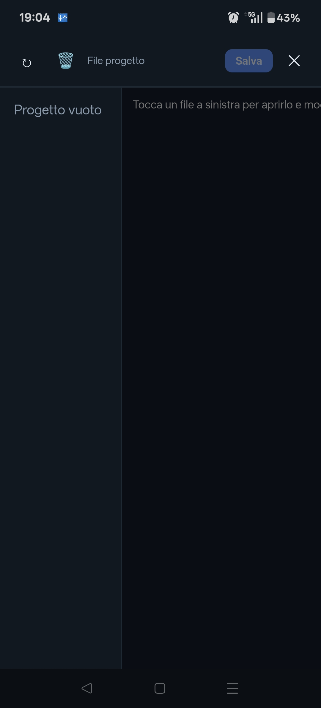

# Cursor for Android (unofficial) — VibeCursor 2

  

### Screenshots

  
  
  

All shots: [`assets/img/`](./assets/img/)

**Unofficial Cursor AI client for Android.**  
There is still **no official Cursor app on Android** (Cursor focuses on desktop + iOS). This APK is a **ready-to-run app**: chat with the agent, use your Cursor account, work on projects and preview — **everything needed is packaged with the app** (one first-time setup download on the phone).

**Latest:** APK **2.0.0** (`site.euroapp.vibecursor2`) · UI `20260911.22` · all-in-one · [Download](https://vibecursor.euroapp.site/VibeCursor.apk)

### Free — no subscriptions

- The **app is free**. There is **no paid subscription** inside VibeAgent.  
- You only need **your own Cursor account** (same as desktop) for the AI agent.  
- Ads support the free app; there is no paid VibeAgent access plan.

> **Not affiliated with Anysphere / Cursor.**  
> Third-party client. Use your **own** Cursor account / API key. Read the disclaimer below.

---

## Community — Telegram

**Project channel:** [https://t.me/VibeCursorAndroid](https://t.me/VibeCursorAndroid) · [@VibeCursorAndroid](https://t.me/VibeCursorAndroid)

APK updates, login tips, news, and the **promo code for 3 free days**. Scan the QR:

  

<b><a href="https://t.me/VibeCursorAndroid">Join Telegram → t.me/VibeCursorAndroid</a></b>

---

## Why this exists (SEO / search)

People search for:

- **Cursor Android** / **Cursor for Android**
- **Cursor AI APK**
- **Cursor agent on Android phone**
- **Cursor alternative Android** (no official Play Store app yet)
- **AI coding assistant Android** like Cursor on mobile

Official Cursor today is mainly **desktop** and **iOS**. This project ships an **Android APK** so you can use Cursor-powered agent workflows on your phone.

---

## Download

**All-in-one APK (~165 MB)** — Linux runtime included; first open only unpacks (no system download).

| Link | Notes |
|------|--------|
| [vibecursor.euroapp.site/VibeCursor.apk](https://vibecursor.euroapp.site/VibeCursor.apk) | Latest **2.0.0** (`vibecursor2`) |

1. Download from the site on the phone.  
2. Allow **Install unknown apps**.  
3. Install → open **VibeCursor**.

> The APK is not stored in this GitHub repo (GitHub 100 MB file limit). Always use the site link above.
