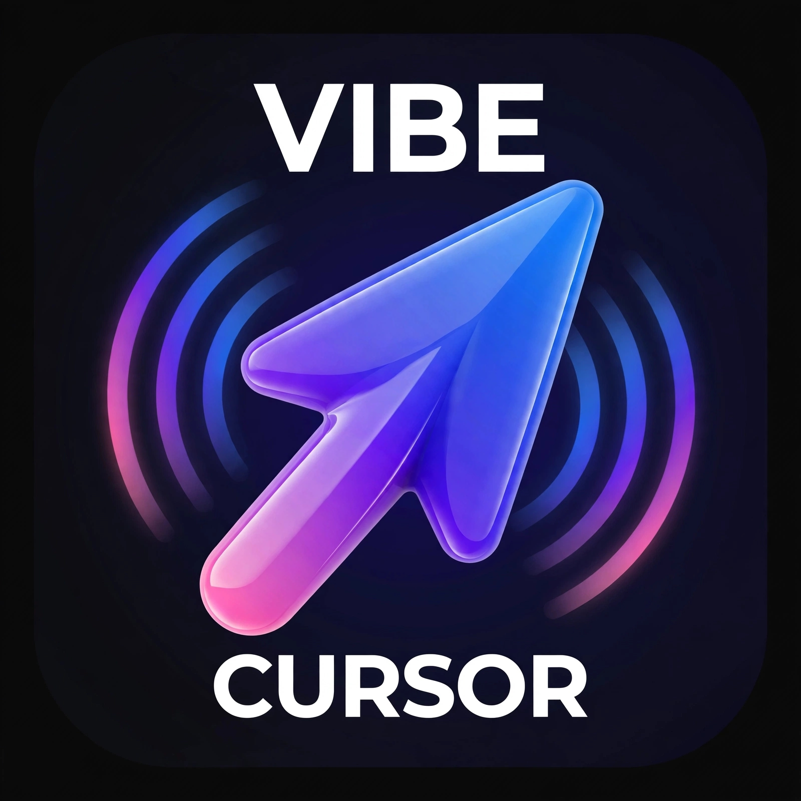

# Cursor for Android (unofficial) — VibeAgent APK

  

**Unofficial Cursor AI client for Android.**  
There is still **no official Cursor app on Android** (Cursor focuses on desktop + iOS). This APK brings a **Cursor Agent–style coding chat** to your phone: login with your Cursor account, run the agent locally, edit projects, preview apps.

> **Not affiliated with Anysphere / Cursor.**  
> Third-party client. Use your **own** Cursor account / API key. Read the disclaimer below.

---

## Why this exists (SEO / search)

People search for:

- **Cursor Android** / **Cursor for Android**
- **Cursor AI APK**
- **Cursor agent on Android phone**
- **Cursor alternative Android** (no official Play Store app yet)
- **AI coding assistant Android** like Cursor / Claude Code on mobile

Official Cursor today is mainly **desktop** and **iOS**. This project ships an **Android APK** so you can use Cursor-powered agent workflows on your phone.

---

## Download

| File | Notes |
|------|--------|
| [`VibeAgent.apk`](./VibeAgent.apk) | Debug build — install on Android 10+ (arm64 recommended) |

1. Copy `VibeAgent.apk` to the phone (or open this repo on the device).
2. Allow **Install unknown apps** for your file manager / browser.
3. Install → open **VibeAgent**.

---

## Minimum requirements

| Requirement | Detail |
|-------------|--------|
| Android | **10+** (API 29+). **arm64** device |
| RAM | **8 GB+** strongly recommended (Linux rootfs + agent) |
| Storage | **~1–2 GB** free (APK ~18 MB + first-time Linux environment ~290 MB) |
| Network | Needed for Cursor login, models, first download |
| Account | **Your** Cursor account (Pro/usage as on cursor.com) |

First launch downloads a **local Linux environment** (rootfs slim ~290 MB) so the agent can run on-device. After that, much of the work stays on the phone.

---

## Features

- **Chat agent** in the style of Cursor / Claude mobile UIs  
- **Login**: OAuth “Continue with Cursor” **or** API key  
- **Models** picker (account models / `/model`)  
- **Modes**: Plan / Ask / Run Everything (force)  
- **Slash commands** (`/usage`, `/help`, `/mcp`, `/summarize`, …)  
- **Projects** on device + optional folder picker (SAF)  
- **File tree** + read / ZIP export  
- **Live preview** for `localhost` / Node / static HTML  
- **OTA UI** updates from CDN  
- **Fullscreen** immersive UI  
- Ads-gated daily access on some builds (rewarded video) — see in-app  

---

## How to log in

### Option A — Continue with Cursor (OAuth)

1. Open the app → **Continua con Cursor**.  
2. Complete login in the browser / system flow.  
3. Return to the app when asked.  
4. If the browser fails: use **Copia link** / open the auth URL manually.

Works best with a normal Cursor subscription on the same account you use on desktop.

### Option B — API key

1. Create a key: [Cursor Dashboard → API Keys](https://cursor.com/dashboard/api?section=user-keys)  
2. In the app: paste the key → **Entra con API key**.  
3. Do **not** share the key. One key per person.

### After login

1. Install / continue the **Linux environment** if prompted (~290 MB, once).  
2. Create or open a **project**.  
3. Chat like on Cursor: ask for code, fixes, previews.

---

## Come accedere (italiano)

- **OAuth:** pulsante *Continua con Cursor* → login sul sito Cursor → torna in app.  
- **API key:** crea la chiave sul [dashboard Cursor](https://cursor.com/dashboard/api?section=user-keys) → incolla in app.  
- **Ambiente:** al primo avvio scarichi il rootfs (~290 MB). Poi lavori offline quanto permette la rete/modello.

---

## Screenshots / brand

Logo bundled: [`assets/logo.jpg`](./assets/logo.jpg) (Vibe / Cursor branding for this unofficial client).

---

## Privacy & safety

- Agent and files run **on your device** (proot Linux), not on our shared coding servers.  
- You authenticate with **Cursor’s** services for models/usage.  
- Unofficial builds may include **AdMob rewarded** access gates — check the screen in the app.  
- Never commit API keys to git. Rotate a key if it leaks.

---

## Disclaimer

**VibeAgent / this repository is an unofficial, independent project.**  
It is **not** an official product of Cursor, Anysphere, or related companies.  
“Cursor” is used only to describe compatibility with the Cursor account / agent ecosystem.  
Use at your own risk. Respect Cursor’s Terms of Service and usage limits.

---

## Support / status

- Private preview while we polish UX and packaging.  
- When public: star the repo and open Issues for Android-specific bugs.  
- Related site assets may live under `cdn.euroapp.site` (UI OTA) — separate from this APK-only repo.

---

## Keywords

`Cursor Android`, `Cursor AI Android APK`, `Cursor for Android unofficial`, `AI coding Android`, `Cursor agent mobile`, `Cursor iOS vs Android`, `VibeAgent`, `run Cursor on phone`
