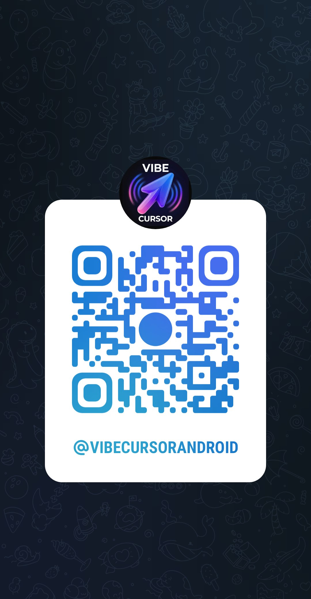

# Cursor for Android (unofficial) — VibeAgent APK

  

**Unofficial Cursor AI client for Android.**  
There is still **no official Cursor app on Android** (Cursor focuses on desktop + iOS). This APK is a **ready-to-run app**: chat with the agent, use your Cursor account, work on projects and preview — **everything needed is packaged with the app** (one first-time setup download on the phone).

### Free — no subscriptions

- The **app is free**. There is **no paid subscription** inside VibeAgent.  
- You only need **your own Cursor account** (same as desktop) for the AI agent.  
- Access can use optional rewarded ads **or** a **promo code** from the Telegram channel (**3 free days** per code use on that phone).

> **Not affiliated with Anysphere / Cursor.**  
> Third-party client. Use your **own** Cursor account / API key. Read the disclaimer below.

---

## Community — Telegram

**Project channel:** [https://t.me/VibeCursorAndroid](https://t.me/VibeCursorAndroid) · [@VibeCursorAndroid](https://t.me/VibeCursorAndroid)

APK updates, login tips, news, and the **promo code for 3 free days**. Scan the QR:

  

<b><a href="https://t.me/VibeCursorAndroid">Join Telegram → t.me/VibeCursorAndroid</a></b>

---

## Why this exists (SEO / search)

People search for:

- **Cursor Android** / **Cursor for Android**
- **Cursor AI APK**
- **Cursor agent on Android phone**
- **Cursor alternative Android** (no official Play Store app yet)
- **AI coding assistant Android** like Cursor on mobile

Official Cursor today is mainly **desktop** and **iOS**. This project ships an **Android APK** so you can use Cursor-powered agent workflows on your phone.

---

## Download

| File | Notes |
|------|--------|
| [`VibeAgent.apk`](./VibeAgent.apk) | Install on Android 10+ (arm64 recommended) |

1. Copy `VibeAgent.apk` to the phone (or open this repo on the device).  
2. Allow **Install unknown apps** for your file manager / browser.  
3. Install → open **VibeAgent**.

---

## Minimum requirements

| Requirement | Detail |
|-------------|--------|
| Android | **10+** (API 29+), **arm64** |
| RAM | **8 GB+** recommended |
| Storage | **~1–2 GB** free (APK ~18 MB + one-time on-device components ~290 MB) |
| Network | For Cursor login, models, and first setup |
| Account | **Your** Cursor account ([cursor.com](https://cursor.com)) |

On first launch the app installs its **built-in runtime pack** on the device (~290 MB, once). After that the agent and your projects stay **on the phone**.

---

## Features

- **Chat agent** (Cursor-style mobile UI)  
- **Login**: OAuth “Continue with Cursor” **or** API key  
- **Models** picker (`/model`)  
- **Modes**: Plan / Ask / Run Everything  
- **Slash commands** (`/usage`, `/help`, `/mcp`, `/summarize`, …)  
- **Projects** on device + folder picker  
- **Files** tree, read, ZIP export  
- **Live preview** for local web apps  
- **Clipboard manager** — save / reuse anything you copy-paste (codes, snippets, API keys, promo codes, links…)  
- **In-app UI updates** when available  
- **Fullscreen** + screen rotation  
- **Free app** — no in-app subscription  
- Optional rewarded access **or** Telegram **promo code** (**3 free days**)  

---

## How to log in

### Option A — Continue with Cursor (OAuth)

1. Open the app → **Continua con Cursor**.  
2. Sign in in the browser / system flow.  
3. Return to the app.  
4. If it stalls: **Copia link** and open it in Chrome.

Same Cursor account as on desktop.

### Option B — API key

1. Create a key: [Cursor Dashboard → API Keys](https://cursor.com/dashboard/api?section=user-keys)  
2. In the app: paste → **Entra con API key**.  
3. Do **not** share the key.

### After login

1. Finish the **one-time setup** if the app asks (~290 MB, Wi‑Fi recommended).  
2. Create or open a **project**.  
3. Chat like on Cursor: code, fixes, previews.

---

## Come accedere (italiano)

- **App gratuita**, **senza abbonamenti** in VibeAgent. Serve il tuo account Cursor per l’agent.  
- **OAuth:** *Continua con Cursor* → login Cursor → torna in app (o *Copia link*).  
- **API key:** [Dashboard API Keys](https://cursor.com/dashboard/api?section=user-keys) → incolla in app.  
- **Setup:** la prima volta l’app installa i componenti inclusi (~290 MB). Poi lavori sul telefono.  
- **3 giorni gratis:** entra nel [canale Telegram](https://t.me/VibeCursorAndroid), prendi il **codice promo** e inseriscilo in app (schermata accesso).  
- **Clipboard / annotazioni:** gestore clipboard in-app — salva e riusa tutti i pezzi che copi/incolli (codici, snippet, chiavi, promo, link).

---

## Brand

Logo: [`assets/logo.jpg`](./assets/logo.jpg)

---

## Privacy policy

**Public URL (use this wherever a privacy link is required — AdMob, stores, forms):**  
**https://cdn.euroapp.site/vibeagent/privacy.html**

Also linked in the app (access screen + Settings).

---

## Privacy & safety

- Agent and project files run **on your device**.  
- Models/usage go through **your Cursor account**.  
- The app itself is **free** (no subscription). Optional rewarded video or a Telegram promo code (**3 free days**) may unlock access time.  
- Full policy: [cdn.euroapp.site/vibeagent/privacy.html](https://cdn.euroapp.site/vibeagent/privacy.html)  
- Never share API keys. Rotate if leaked.

---

## Disclaimer

**VibeAgent / this repository is unofficial and independent.**  
Not a product of Cursor / Anysphere.  
“Cursor” only describes account/agent compatibility.  
Use at your own risk and respect Cursor’s Terms of Service.

---

## Support

- **Telegram:** [t.me/VibeCursorAndroid](https://t.me/VibeCursorAndroid)  
- Private preview for now; Issues when the repo goes public.

---

## Keywords

`Cursor Android`, `Cursor AI Android APK`, `Cursor for Android unofficial`, `AI coding Android`, `Cursor agent mobile`, `Cursor iOS vs Android`, `VibeAgent`, `VibeCursorAndroid`, `Telegram Cursor Android`, `run Cursor on phone`
